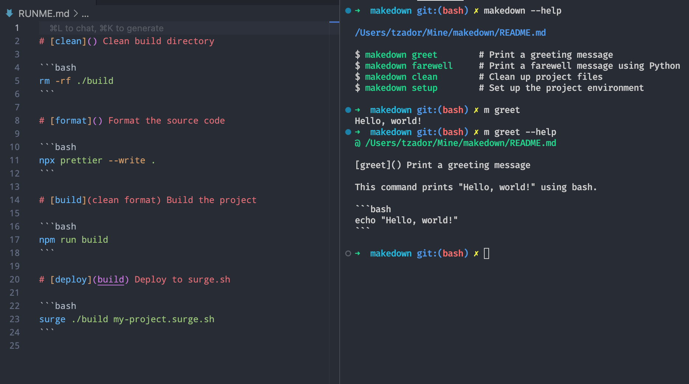

# [makedown](https://makedown.dev) - Markdown + Makefile = Self documenting shell scripts

Lorem ipsum dolor sit amet, consectetur adipiscing elit, sed do eiusmod tempor incididunt ut labore et dolore magna aliqua.
Ut enim ad minim veniam, quis nostrud exercitation ullamco laboris nisi ut aliquip ex ea commodo consequat.
Duis aute irure dolor in reprehenderit in voluptate velit esse cillum dolore eu fugiat nulla pariatur.
Excepteur sint occaecat cupidatat non proident, sunt in culpa qui officia deserunt mollit anim id est laborum.

{width="100%"}

```
00000000001111111111222222222233333333334444444444555555555566666666667777777777888888888899999999990000000000
01234567890123456789012345678901234567890123456789012345678901234567890123456789012345678901234567890123456789
```

### Test

#### [alpha](https://makedown.dev/alpha){best=fest}

### Explanation:

- **Green** monospace is used for the main greeting `print(f"Hello, {name}!")`.
- **Red** monospace is used for the `print("Access granted.")` for the "Admin".
- **Blue** monospace is used for the `print("Access denied.")`.

In Markdown preview, the code block is still rendered as a Python code block with colored monospace sections embedded via `<span>` tags. However, remember that this approach might not always render as intended in GitHub's Markdown due to security restrictions on styles.

And here’s how it looks in raw HTML mixed with Markdown:

```python
def greet(name):
    # Print a greeting
    <span style="color: green; font-family: monospace;">print(f"Hello, {name}!")</span>
    if name == "Admin":
        <span style="color: red; font-family: monospace;">print("Access granted.")</span>
    else:
        <span style="color: blue; font-family: monospace;">print("Access denied.")</span>
```

````markdown
```python
def greet(name):
    # Print a greeting
    <span style="color: green; font-family: monospace;">print(f"Hello, {name}!")</span>
    if name == "Admin":
        <span style="color: red; font-family: monospace;">print("Access granted.")</span>
    else:
        <span style="color: blue; font-family: monospace;">print("Access denied.")</span>
```
````

Hello <span style="color: red; font-family: monospace;">print("Access granted.")</span> World

<span style="color: blue; font-family: monospace;">print("Access denied.")</span>
